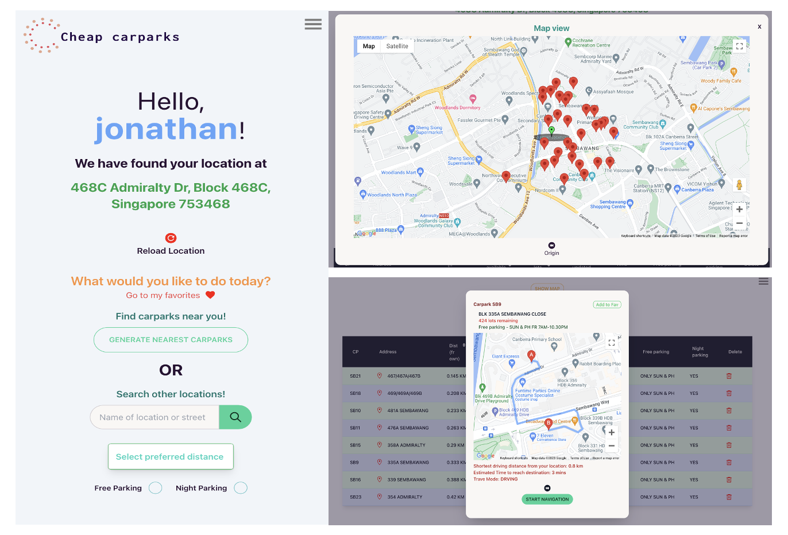

# Carpark Availability App

## Live Link
https://sensational-zabaione-393a34.netlify.app/
- App is best experienced using Chrome Browser. 

## Starting the App from IDE

1. npm install
2. npm run netlify dev

## Description

The Carpark Availability App allows user:
1. To search for available lots in HDB-run carparks near their current location or a location of their choosing by using APIs to harness data from a variety of sources. (Primary)
2. To navigate to carpark destinations using Google Direction. (Primary)
3. To save carpark locations in localstorage as Favorites, to retrieve for use in future. (Primary)
4. To communicate with passager via Whatsapp API on driver's pickup location, along with navigation for passenger to reach a driver's location. (Add-on)
5. To send SOS help signals to nominated person if a driver encounters any critical situations. Use-cases include (i.e. medical emergencies, dangerous situations, vehicle breakdown and etc.) (Add-on)

Try out our project [here](https://sensational-zabaione-393a34.netlify.app 'link to deployed site')!

## Important to note before using the app:

- No login is required
- The User Agreement is meant to seek user's consensus in releasing his/her current coordinates.
- User MUST enable location settings on their browsers for the application to work.
- This is a proof-of-concept application done as a group project for a software engineering course.

## Features

- User location tracking
- Carpark lot availability tracking (refreshed hourly)
- Table of results
  - Search parameters (location, distance, free parking, night parking)
  - Filtering of results (by distance, lots available, total lots)
  - Ability to edit results (deletion of carparks with no lots availabile)
  - Pagination
  - Route planning for drivers (via driving)
- Login functionality
  - Automatically generated message for passenger route planning (via walking)
  - Emergency contact nomination
  - One-click SOS
- Mobile responsiveness

## Resources Used

- Google Directions API
- Google Geocoding API
- Google Maps Javascript API
- [@react-google-maps/api](https://github.com/JustFly1984/react-google-maps-api/tree/master/packages/react-google-maps-api 'react google maps api')
- [Geolib](https://github.com/manuelbieh/geolib#readme 'geolib')
- [React Whatsapp](https://github.com/andrelmlins/react-whatsapp 'react whatsapp')

## Team

- [Jonathan](https://github.com/goodwill80 "jonathan's github")
- [Ace](https://github.com/acetay "ace's github")
- [Yingwang](https://github.com/shiywsg "yingwang's github")
- [Claire](https://github.com/clairetkw "claire's github")
